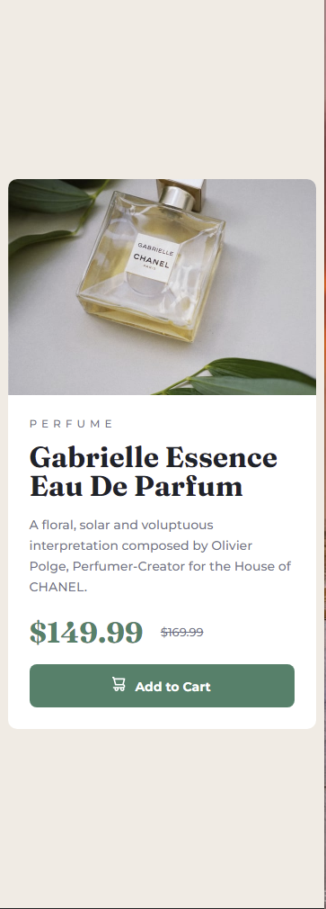
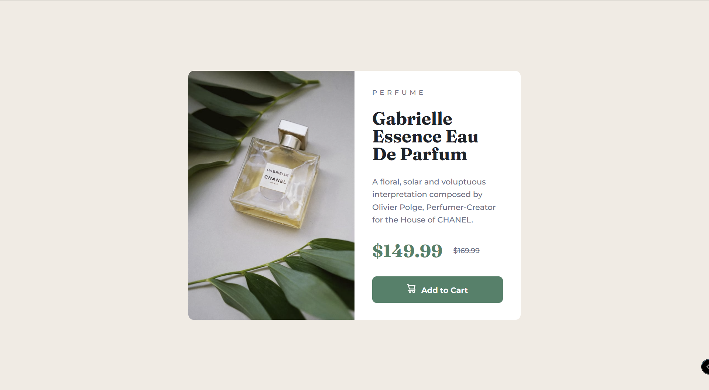

# Frontend Mentor - Product preview card component solution

This is a solution to the [Product preview card component challenge on Frontend Mentor](https://www.frontendmentor.io/challenges/product-preview-card-component-GO7UmttRfa).

## Table of contents

- [Overview](#overview)
  - [The challenge](#the-challenge)
  - [Screenshot](#screenshot)
  - [Links](#links)
- [My process](#my-process)
  - [Built with](#built-with)
  - [What I learned](#what-i-learned)
  - [Continued development](#continued-development)
  - [Useful resources](#useful-resources)
- [Author](#author)
- [Acknowledgments](#acknowledgments)

## Overview

### The challenge

Users should be able to:

- View the optimal layout depending on their device's screen size, specifically for a mobile screen size of 375px width or less.
- See hover and focus states for interactive elements, in this case the <button> element.

### Screenshot

### Links

- Solution URL: [Add solution URL here](https://your-solution-url.com)
- Live Site URL: [Add live site URL here](https://your-live-site-url.com)

## My process

### Built with

- Semantic HTML5 markup
- CSS custom properties including 1 media query
- Flexbox
- CSS Grid
- Google 
- Figma

### What I learned

My goals for this project, which I felt I reached sufficiently, were:

1. Increase my proficiency and speed with building a basic website without, focusing on using HTML and CSS only. 
  **In this project, I saw my overall completion time even though this was a more complicated and detailed project.
  **My choices for structure and styling were a reflection of my overall strategy for completing the page. I.e., my choice of containers to position child elements were more deliberate; my approach to spacing between sibling elements was more consistent, etc.

2. Learn to use Figma to have access to styles without having to play the "eyeball it" game quite as much. I discovered that Figma is a wonderful tool whether you are working alone or in teams. However, I did find that, although I used the style guide, and the setting echoed by Figma, on screen, some of the colors did not look the same when observed side-by-side. The most prominent of these was the green of the <button> element.

3. Establish my own comfortable workflow. Here is what I have established so far:
  **Orient myself to the project by reading through the project goals, taking a look at the final product, and walking through the style-guide.
  **Decide on my tools to complete the task (eg. HTML, CSS, Figma, JQuery, etc.)
  **Structure my file system accordingly and create the necessary files: index.html, styles.css, app.js, etc.
  **Load my Figma file into the desktop app
  **Decide on the high-level structure; create my HTML header and general skeletal structure (<html>, <head>, <body>, <nav>, <header>. <main>, <footer>) and possibly major sections.
  **Fill in the page's content: text, images, etc. making notes and reminders if necessary.
  **Structure my styles.css with my personal template: page reset & variables, containers, elements, ID's & classes, media queries. Using the style guide, I may make some notes or throw in some styles if explicit or perscribed.
  **Work through the html page and do the basic style from top to bottom for mobile first (well, okay, I admin I usually start with the desktop versions first!) styles. 
  **Go back and pick up other effects such as :hover or animations/transformations, if necessary.
  **Tackle the media queries, one size at a time, restyling as necessary
  **Check code for redundancy or lack of clarity. If complex, I will add notes. I try to make the code as clean as possible.
  **If not already done, I use git to version my first draft. The the site is complex or the page complicated, this process would be done much earlier.
  **Publish or submit the project.

### Continued development

My future goals are to increase speed and proficiency on larger and more difficult projects. By doing so, my hope is to not have to think so much about the "how" and focus on the creativity, efficiency, and overall competency.

As my prowess increases, I want to incorporate and do the same with the other tools I have learned, both front end and back end. I am making a career change in 5 months, so I have a great deal of motivation to move forward. We'll see if I can maintain the discipline. :)

### Useful resources

- [Figma](https://www.figma.com) - I upgraded my account with Frontend Mentor to a Pro account and it gave me access to the Figma files. These files are sooooooo helpful and provide the details of font size, styles, etc. and take the guess work, and wasted time, in judging the difference of .1rem in spacing or font size.

## Author

- GitHub - [@jguleserian](https://github.com/jguleserian)
- Frontend Mentor - [@jguleserian](https://www.frontendmentor.io/profile/jguleserian)
- LinkedIn - [@jeffguleserian](https://www.linkedin.com/jeffguleserian)

## Acknowledgments

I want to give a shoutout to @Haywayaheadshot

This is only my second challenge. My first challenge was reviewed by the Frontend Mentor peer, mentioned above, who offered me a word of encouragement and some advice which got me thinking more about my overall planning of structure. The result was that it built my confidence and made something "click" in my method and insight. I am grateful to him for taking the time to point me in the right direction.
